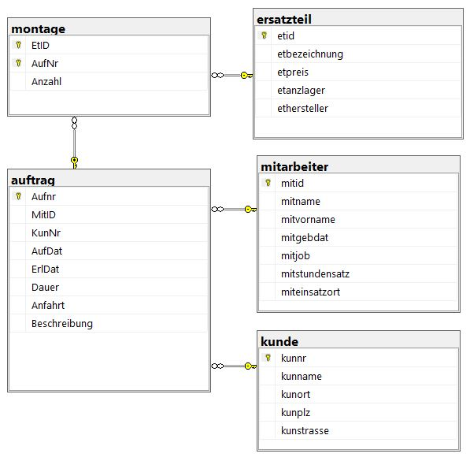

=== Aufbau der Trommelhelden-Datenbank

Generell arbeitet die Firma auf folgende Weise: Das Unternehmen nimmt von den Kunden Reparaturaufträge entgegen. Dabei werden die Daten des Kunden, das Auftragsdatum und ggf. eine Beschreibung des konkreten Problems erfasst. Anschließend wird der offene Auftrag einem Mitarbeiter zugeteilt, der nach der Bearbeitung das Erledigungsdatum, Anfahrtsdaten sowie Ersatzteile notiert, die bei der Reparatur zum Einsatz kamen.

Für einen neuen Datensatz in der Auftragstabelle, welcher eindeutig über eine Auftrags-ID identifiziert werden kann, wird also neben der Problembeschreibung und des Auftragsdatum eine Kunden-ID benötigt. Diese verweist auf einen bereits existierenden Eintrag in der Kunden-Tabelle, welcher den Namen des Kunden sowie die Adresse, bestehend aus Straße, Postleitzahl und Wohnort, beinhaltet.

Wurde der Auftrag einem Mitarbeiter zugewiesen, wird die dazugehörige Mitarbeiter-ID dem Auftragsdatensatz hinzugefügt. Auch diese bezieht sich auf einen Datensatz in einer separaten Tabelle, welche alle eingestellten Mitarbeiter listet. Zusätzliche zum vollständigen Namen des Mitarbeitenden und des Geburtsdatums wird auch der konkrete Jobtitel (Meister, Monteur, Azubi..), der dazugehörige Stundenlohn und der Einsatzort gespeichert.

Wurde der Auftrag beim Kunden abgeschlossen, wird der Datensatz in der Auftragstabelle ergänzt um das Erledigungsdatum, die Dauer des Auftrages in Stunden, die zurückgelegte Strecke für die eigentliche Anfahrt in Kilometer und ggf. eine Beschreibung der erbrachten Serviceleistung. Sollten bei dem Auftrag Ersatzteile verbaut worden sein, entsteht ein Eintrag in der Montage-Tabelle. Diese Listet zum jeweiligen Auftrag die Anzahl und die spezifische ID des genutzten Teils.

Zu der passenden ID enthält die Ersatzteil-Tabelle weitere Informationen. Dazu zählt die Bezeichnung des Bauteils, der Preis, die vorhandene Menge im Lager und der Hersteller.

.Datenbankdiagramm der Trommelheldendatenbank

