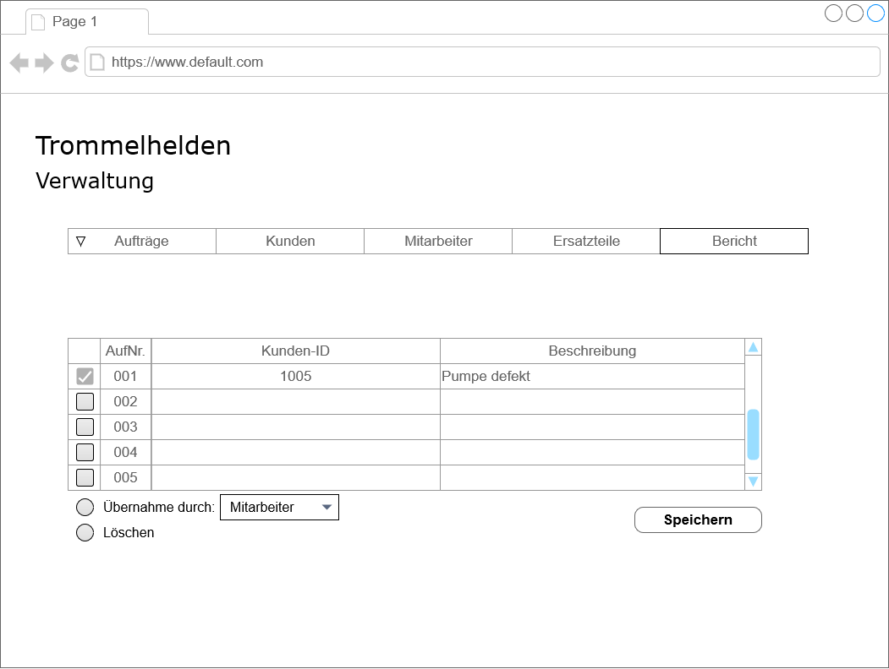
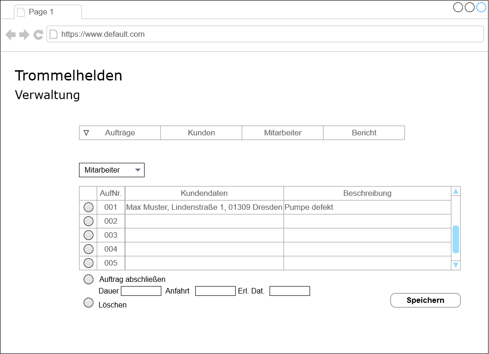

==== Use-Case 03: Verwaltung von Aufträgen

*Kurzbeschreibung* +
Das System ermöglicht es Aufträge anzulegen, offene Aufträge einzusehen, offene Aufträge einzusehen, offene Aufträge Mitarbeitern zuzuordnen und Aufträge abzuschließen

*Auftrag annehmen* +
Vorbedingung: der Auftraggeber ist Teil der Kundendatei +

. der Use-Case beginnt, wenn der Kundentab und die Auftragsfunktion eines Kunden ausgewählt wurden
. dem System wird eine Beschreibung des Auftrages übergeben
. der Use-Case ist abgeschlossen, sobald der neue Auftrag gespeichert wurde

*Auftrag zuweisen* +

. der Use-Case beginnt, wenn der Auftragstab ausgewählt wurde
. der Use-Case ist abgeschlossen, sobald dem offenen Auftrag ein Mitarbeiter zugewiesen wurde

*offene Aufträge einsehen* +

. der Use-Case beginnt, wenn der Auftragstab ausgewählt wurde
. über die Angabe eines Mitarbeiters können offene Aufträge eingesehen werden, die speziell von diesem Mitarbeiter bearbeitet werden sollen
. damit ist der Use-Case angeschlossen

*Auftrag abschließen* +

. der Use-Case beginnt, wenn der Auftragstab sowie die Abschluss-Funktion ausgewählt wurden
. dem System werden die restlichen Auftragsdaten übergeben
. der Use-Case ist abgeschlossen, sobald die Eingaben bestätigt wurden

<<<
*Wireframes für den Auftragstab*

.Auftrag annehmen / Neue Aufträge

.Offene Aufträge
